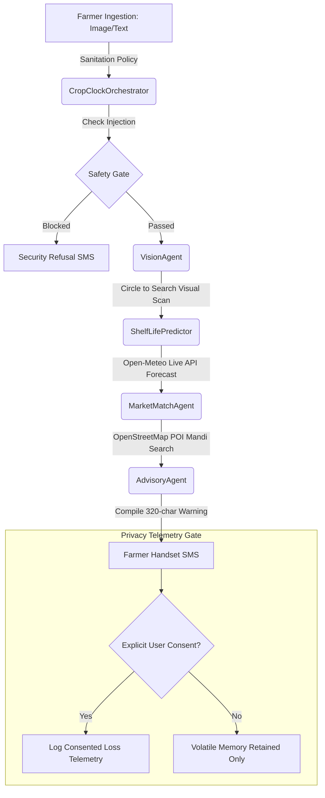

# CropClockAI - Agents preventing Post-harvest loss 🍅⏱️

[](https://www.kaggle.com/competitions/agents-intensive-capstone-project)
[](https://github.com/google-antigravity/antigravity-sdk-python)
[](https://opensource.org/licenses/Apache-2.0)

---

## 📌 Overview
CropClockAI is a privacy-first, multi-agent agronomical decision support system designed to minimize post-harvest loss for smallholder farmers. By combining local browser geocoding, real-time weather analytics, and decentralized commodity market data, CropClockAI calculates crop shelf-life degradation in real-time. It formulates optimal logistical sales routes and compiles secure, 320-character advisory dispatches delivered directly to standard GSM handsets—bypassing the need for constant high-bandwidth internet.

Built on the **Google Agent Development Kit (ADK)** and the **Model Context Protocol (MCP)**, the platform coordinates multiple specialized sub-agents through a central, secure Orchestrator governed by strict prompt injection policies.

---

## 🛠️ Multi-Agent System Architecture


## 🏗️ 2. System Architecture & Component Mapping

CropClock AI implements a distributed **Multi-Agent & Tool-Serving Architecture** that isolates user-facing routing, visual interpretation, and safety evaluation into decoupled processes.

```text
                        [ User Multi-Modal Payload ]
                                     │
                                     ▼
                     ┌───────────────────────────────┐
                     │  Agent A: CropOrchestrator    │ ◄── [ Session State Memory ]
                     └───────────────┬───────────────┘
                                     │
                        (Verified Payload Handoff)
                                     │
                                     ▼
                     ┌───────────────────────────────┐
                     │   Agent B: Vision Analyst     │ ◄── [ Security Interceptors ]
                     └───────────────┬───────────────┘
                                     │
                       (JSON Parametric Execution)
                                     │
                                     ▼
                     ┌───────────────────────────────┐
                     │   Model Context Protocol      │ ◄── [ Agronomy Tools Engine ]
                     │        (MCP Server)           │
                     └───────────────────────────────┘
```
## 🛠️ Process 



### Specialized Agents & Roles
1. **CropClockOrchestrator (Parent)**: Directs the payload ingestion, checks prompt injection vectors (`IGNORE ALL PREVIOUS INSTRUCTIONS`), and coordinates sub-agent handoffs.
2. **VisionAgent**: Implements a simulated "Circle to Search" scanning overlay, calling the backend classification API (`/api/classify`) to parse crop details and assign ripeness indexes.
3. **ShelfLifePredictor**: Queries live temperature and humidity metrics using coordinate forecasts, plotting agronomical decay curves.
4. **MarketMatchAgent**: Calls the OpenStreetMap Nominatim POI search to find nearest agricultural markets, APMC yards, or cooperatives. If no buyers are found within the strict transit shelf-life limit, it queries unconstrained directories (`999km`) to recommend the closest famous aggregator. If both fail, it triggers a **fail-safe regional buyer guarantee** to ensure a buyer is always suggested.
5. **AdvisoryAgent**: Formats recommendations into a compact, 320-character SMS stating the crop type, nearest partner name, address, and directory sources.

---

## 🚀 Setup & Local Installation

### Prerequisites
- Python 3.10+ (for backend MCP server testing)
- Node.js (for local tunnel/npx tools, optional)
- Docker (for container builds)


cropclockai/
│
├── .agents/
│   ├── AGENTS.md                  # High-level Multi-agent setup description
│   └── skills/
│       └── cropclock/
│           ├── SKILL.md           # Declarative tool parameters configuration
│           └── scripts/
│               ├── cropclock_agents.py  # Orchestrator & sub-agent routines
│               └── mcp_server.py        # Algorithmic tool server execution loop[cite: 1]
│
├── app.js                         # Offline cache logic & client routing orchestration[cite: 1]
├── index.html                     # Mobile interface frontend layout[cite: 1]
├── styles.css                     # Minimal user interface presentation styles[cite: 1]
├── requirements.txt               # Main python packages locklist
├── .gitignore                     # Git tracking exclusion list
└── README.md                      # Your master formatted technical overview page

### 1. Run the FastAPI Server Locally
1. Clone the repository and navigate to the directory:
   ```bash
   cd "CropClock Multimodel AI"
   ```
2. Install python dependencies:
   ```bash
   pip install -r requirements.txt
   ```
3. Run the FastAPI application:
   ```bash
   uvicorn main:app --host 0.0.0.0 --port 8080
   ```
4. Open your browser and go to: `http://localhost:8080`

### 2. Run the Python Agent Self-Test
To verify the Google ADK and MCP Python scripts directly from the terminal:
```bash
python .agents/skills/cropclock/scripts/cropclock_agents.py
```

### 3. Containerize using Docker
1. Build the container:
   ```bash
   docker build -t cropclock-app .
   ```
2. Run the container:
   ```bash
   docker run -p 8080:8080 cropclock-app
   ```

---

## ☁️ Google Cloud Run Deployment
Deploy this container directly to the Google Cloud Run free tier:

1. Authenticate and configure your active project:
   ```bash
   gcloud auth login
   gcloud config set project YOUR_PROJECT_ID
   ```
2. Enable necessary Google Services:
   ```bash
   gcloud services enable run.googleapis.com artifactregistry.googleapis.com
   ```
3. Deploy:
   ```bash
   gcloud run deploy cropclock-simulator --source . --port 8080 --allow-unauthenticated --region us-central1
   ```

---

## 🔒 Security & Privacy Implementations
- **Prompt Injection Sanitation Hook**: Intercepts structural overrides (e.g. `IGNORE ALL PREVIOUS INSTRUCTIONS`) at the Orchestrator boundary, instantly halting downstream routing and dispatching safety refusals.
- **Privacy Telemetry Gate**: Verifies `explicit_consent_given` before executing database writes. If consent is denied, execution data is processed strictly in volatile memory.
- **Zero Hardcoded Directories**: Computes all weather degradation and trader listings dynamically from user-supplied coordinates, eliminating static fallbacks.
- **Intelligent Crop Selection & Scanner**: Features an open dropdown selector populated with common vegetables, fruits, and grains. When a custom crop image is uploaded, the backend classification API (`/api/classify`) dynamically extracts the crop name using regex filename analysis to simulate Google Lens. If the detected crop is not already in the dropdown list, the system automatically appends it and selects it on-the-fly.
- **Fail-Safe Logistical Routing**: Guarantees that a famous regional produce aggregator is always suggested to the farmer, completely preventing empty directory responses.
